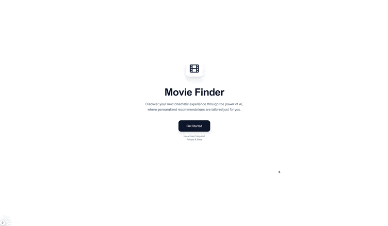

<h1 align="center">Movie Finder :film_strip:</h1>

A intelligent movie recommendation system that uses advanced techniques to recommend movies based on your preferences.

<p align="center">
  
</p>

## :sparkles: Key Features

- Platform-independent movie recommendations
- Genre Selection
- Mood Choice
- Era Timeframe Options
- Language Decision
- Notes for in-depth personalization

## :rocket: Getting Started

### :computer: Prerequisites

- Git
- Bun.js (OR: npm & node)
- Python 3.12

### :package: Installation

```bash
# Clone the repository
git clone git@github.com:IImpaq/air-2024.git
cd air-2024

# Prepare the backend
cd backend
pip install -r requirements.txt
python fetch.py      # Fetch dataset from huggingface
python preprocess.py # Prepare and preprocess the data
cd ..

# Prepare the frontend
cd frontend
bun install # OR: npm install
cd ..
```

### :gear: Running

**Full-Stack Application**

```bash
# Terminal 1: Start Frontend
cd frontend
bun run dev # Website Available at http://localhost:3000

# Terminal 2: Start Backend
cd backend
uvicorn main:app --reload  # API available at http://localhost:8000
```

**CLI Mode**

```bash
# Run backend/movie recommender in interactive cli mode
cd backend
python cli.py
```

**Evaluate the recommender system**

```bash
# Run the automated evaluation script
cd backend
python evaluation.py
```

## :books: Dataset

Already included is the preprocessed dataset. It includes around 180.000 rows and the following columns:
```js
["id", "title", "genres", "original_language", "overview", "popularity", "vote_average", "release_date", "status", "keywords", "credits", "poster_path"]
```
The preprocessed dataset is generated from the raw data of the [wykonos/movies](https://huggingface.co/datasets/wykonos/movies) collection that is published on [Hugging Face](https://huggingface.co/).

## :wrench: Tech Stack

- Frontend: NextJS & TypeScript
- Backend: Python, FastAPI & PyTorch

## :memo: License

MIT License (see [LICENSE.MD](LICENSE.md)).

## :link: Links

- [Design Document](design-document/design-document.pdf)
- [Report](report/report.pdf)
- [Presentation](presentation/presentation.pdf)
- [Questionnaire](questionnaire/questionnaire.pdf)
- [Evaluation](evaluation/)
- [Movie Dataset](https://huggingface.co/datasets/wykonos/movies)

## :telephone: Contact
If you have any questions or want to get in touch, just [send me an email](mailto:iimpaq@proton.me)

---
Made with :heart:
